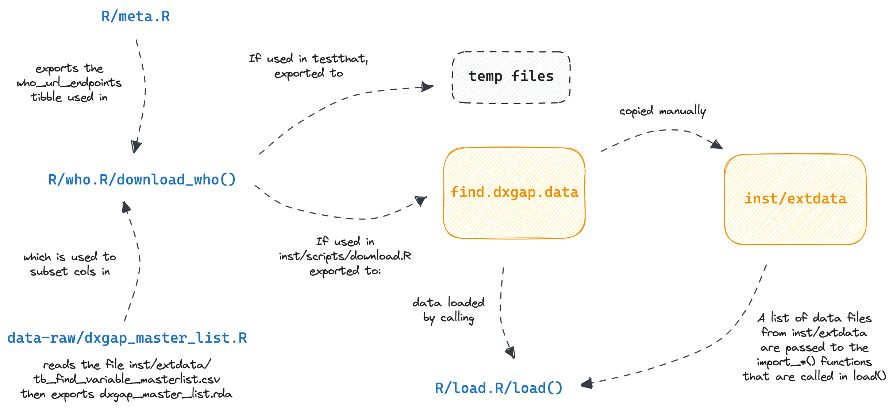

<!-- README.md is generated from README.Rmd. Please edit that file -->

```{r, include = FALSE}
knitr::opts_chunk$set(
  collapse = TRUE,
  comment = "#>",
  fig.path = "man/figures/README-",
  out.width = "100%"
)
```

# find.dxgap

<!-- badges: start -->
[](https://www.repostatus.org/#wip)
<!-- badges: end -->


## Installation
This project aims to both find the determinants of the DX Gap in TB, and to
generalise these methods into a broader R package framework for other diseases.
This creates the need for a project structure that both allows for a high-level of
reproducibility (using exact R package versions to reproduce analyses calculating
determinants) and for generalisability (so that the methods work across different
R package versions in the future).

To achieve reproducibility, the [`renv`](https://rstudio.github.io/renv/articles/renv.html)
package is used to create a reproducibile environment. Take this approach when
you want to exactly reproduce any analyses performed as part of this project.
To use this project with `renv`:

1. [Clone](https://docs.github.com/en/get-started/getting-started-with-git/about-remote-repositories#cloning-with-https-urls)
the package with HTTPS/SSH.
2. If this is your first time running the project, `renv` should automatically
bootstrap itself, downloading and installing the appropriate version of renv.
3. You will then be prompted to download and install all the packages needed by
running `renv::restore()`.

To achieve generalisability and to install this project as an R package, the
[`DESCRIPTION`](https://r-pkgs.org/description.html#sec-description-imports-suggests)
file is used to specify package dependencies. Take this approach when you want
to use the functions and ideas within the package. You can install the development
version of find.dxgap from [GitHub](https://github.com/) with:

``` r
# install.packages("devtools")
devtools::install_github("finddx/find.dxgap")
```

## find.dxgap.data

Data for the project are stored in a directory called `find.dxgap.data`. Please,
call `write_data_dir()` to create and populate such folder.

The data available are:

```{r echo=FALSE}
tibble::tibble(data_file = list.files("inst/extdata", pattern = "csv")) |> 
  knitr::kable()
```

The below schema represents the flow of data in this package to aid with
future developments:



## Report

Call, `render_report(year = 2019)` to render a report for given year. Create new
templates and render them using the `template_path` parameter.

## Objectives of the project

Support in data analysis / processing for the development of a Shiny dashboard
(**TB Diagnostics Policy dashboard**) that will show *by country* the:

  - *TB diagnostic landscape* 

  - *TB burden*

More specifically it will show:

  - Countries with similar demographics to improve the learning of algorithms
  - Need for testing by region and test type
  - Assess readiness and willingness of countries for new upcoming TB diagnostics
  - Understand *Gap* in testing and TB incidence in a country
  - Assess existing association between algorithms and *TB incidence* / % of
  cases bacteriologically confirmed

## TB dignosis Crash Course


### Tubercolosis 

Tuberculosis (TB) is a disease caused by germs that are spread from person to
person through the air. TB usually affects the lungs, but it can also affect
other parts of the body, such as the brain, the kidneys, or the spine. A person
with TB can die if they do not get treatment.

### Process

- Show symptoms (plus, so called *asymptomatic*)

- Get tested

### How to detect

  - Blood tests
  
  - Skin tests
  
  - *Rapid tests*


### Issues

- "Latent TB infection"" vs "TB disease"

- Gap between estimated and notified cases

- DR-TB (**Drug-resistant TB**):

  - multidrug or rifampicin-resistant TB (MDR / RR-TB)
  - due to: *Mycobacterium tuberculosis complex bacteria (MTBC)*
  
- Needs for laboratories (DST)

### Management of TB spread

- Rapid diagnosis:

  - *drug-susceptibility testing (DST)* 
  
  - fast and accurate detection tests

- Rapid detection of DR-TB

- Effective treatment regime

### Policy

WHO developed a global strategy for TB prevention (*End TB Strategy*) with goals to meet.

### Metrics

- point prevalence

- period prevalence

- incidence rate (or, *cumulative incidence rate*) = (numb. of new cases arising
from a definined pop. in a specified time period) / (numb. in defined at-risk
pop. over the same time period)

- incidence density

- illness duration


### Glossary

**POC: Point-of-care diagnostic tests for tuberculosis disease**

They facilitate early detection, immediate treatment, and reduced transmission of TB disease.

Types:

- Oral Swab testing

- GeneXpert® Systems technology by Cephid
  - Workstation for molecular diagnostics
  
- Urine LF-LAM 

- ...

**WHO dashboard**

https://www.who.int/teams/global-tuberculosis-programme/data

**Model (diagnostic) algorithms**

Effective and efficient TB diagnostic algorithms are key components of a
diagnostic cascade designed to ensure that patients with TB are diagnosed
accurately and rapidly, and are promptly placed on appropriate therapy.

Objectives:

- Screening

- Diagnosis

Example:


**WHO HBC**

WHO render a list of High burden countries (HBCs) for TB, TB/HIV, etc.


**Prevention**

- primary

- secondary

- tertiary


### Source:

- [WHO operational handbook on TB - Dignosis Module](https://www.who.int/publications/i/item/9789240030589)

- [WHO Global TB report](https://www.who.int/teams/global-tuberculosis-programme/data#gtbr)

- [Global Epidemiology of Tuberculosis](https://www.ncbi.nlm.nih.gov/pmc/articles/PMC4315920/)

- [Diagnosing the diagnostic gaps](https://www.youtube.com/watch?v=pvp7HiHOU2Q)
